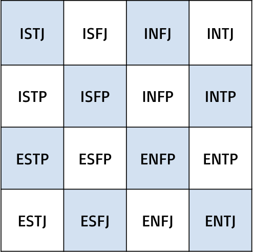

# Myers-Briggs Type Indicator Predictor

## What is the [Myers-Briggs Type Indicator](https://www.myersbriggs.org/) (MBTI)?
The MBTI was created by Isabel Briggs Meyers and Katherine Briggs to contextualize psychologist [Carl Jung's theory] (https://www.verywellmind.com/what-are-jungs-4-major-archetypes-2795439) of the 4 psychological archetypes. Myers and Briggs theorized that differences in personality are not random (or by this logic, very unique) but follow consistent rules in which people perceive the world. 

## What are the MBTI types?
There are 4 different MBTI identifiers that make up 16 total different classifications.

The classifications are as follows: 

**Favorite World**: *Do you prefer to focus on the outer world or on your own inner world?* [[1]](#1)
- **E**xtraversion or **I**ntraversion

**Information**: *Do you prefer to focus on the basic information you take in or do you prefer to interpret and add meaning?* [[1]](#1)
- **S**ensing or **I**ntuition

**Decisions**: *When making decisions, do you prefer to first look at logic and consistency or first look at the people and special circumstances?* [[1]](#1)
- **T**hinking or **F**eeling

**Structure**: *In dealing with the outside world, do you prefer to get things decided or do you prefer to stay open to new information and options?* [[1]](#1)
- **J**udging or **P**erceiving

  

Take the test yourself [here](https://www.16personalities.com/free-personality-test)!
For more information on each of the classifications and types, please visit [this page](https://www.myersbriggs.org/my-mbti-personality-type/mbti-basics/the-16-mbti-types.htm). 

## The Data
I have selected a [dataset](https://www.kaggle.com/datasnaek/mbti-type) provided by Kaggle with MBTI type classifications for over 8,500 anonymized users and many of their forum posts on the site [PersonalityCafe](https://www.personalitycafe.com/). I have transformed this data so that each observation becomes a post with an associated MBTI type as opposed to each user and their multiple posts. This leaves us with almost 380,000 observations. 

## References
<a id="1">[1]</a> 
[The Myers-Briggs Foundation](https://www.myersbriggs.org/my-mbti-personality-type/mbti-basics/)
